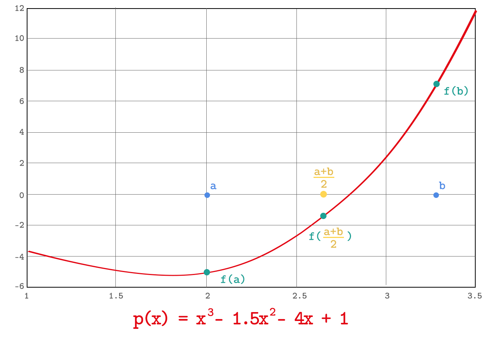
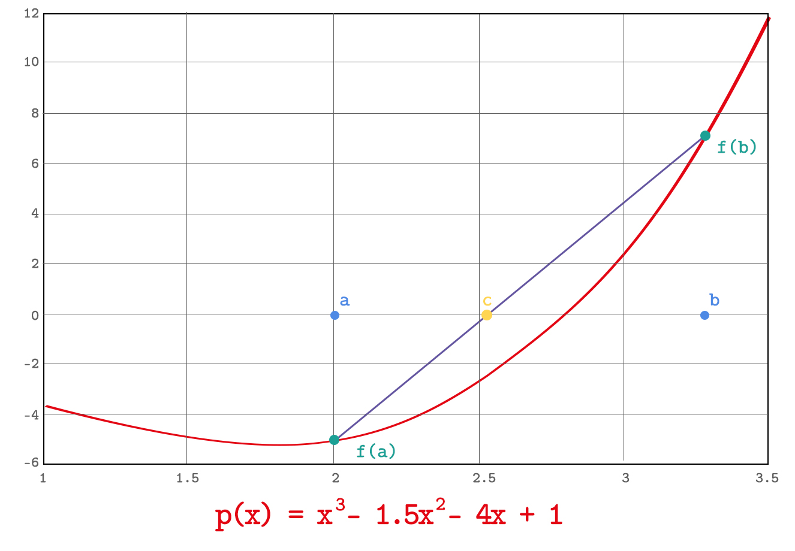

# Polynomial Solver / Root Finding (Interval Bisection vs Secant Method)
There are several approaches to find roots of a given polynomial via computer assistance with finite precisions. Some of the common techniques to deal with such problems are [Interval Bisection](https://en.wikipedia.org/wiki/Bisection_method#:~:text=In%20mathematics%2C%20the%20bisection%20method,two%20values%20with%20opposite%20signs.&text=The%20method%20is%20also%20called,method%2C%20or%20the%20dichotomy%20method.), [Broyden’s Method](https://en.wikipedia.org/wiki/Broyden%27s_method#:~:text=In%20numerical%20analysis%2C%20Broyden's%20method,a%20difficult%20and%20expensive%20operation.), [Newton’s Method](https://en.wikipedia.org/wiki/Newton%27s_method), [Secant Method](https://en.wikipedia.org/wiki/Secant_method#:~:text=In%20numerical%20analysis%2C%20the%20secant,difference%20approximation%20of%20Newton's%20method.), [Inverse Interpolation](https://en.wikipedia.org/wiki/Inverse_quadratic_interpolation), [Fixed-Point Iteration](https://en.wikipedia.org/wiki/Fixed-point_iteration) etc.

Each approach discussed above has several advantages/disadvantages over each other. One method may converge to a root for a given polynomial while the other method diverges. Different approaches may converge distinct roots of the polynomial. Some approaches (e.g. Interval Bisection) can be used only to solve non-linear equations with one unknown (1D) (e.g. ={x_1}^7-20{x_1}^5%2B\frac{22}{3}{x_1}^2%2B1729) ) while some approaches (e.g. Broyden’s Method) can be used to solve systems of non-linear equations or simply  (e.g. =x_1^4%2B3x_2^2-x_1) ). Hence, the right approach must be chosen to reach a proper solution with efficient use of sources. Accordingly, the behaviour or rough shape of the function space should be considered before choosing and implementing one of the approaches above.

Through this simple project, it is aimed to show differences between Interval Bisection and Secant Method, in terms of use of sources such as running time. Let's take a look at these approaches first.

**INTERVAL BISECTION:**

The Interval Bisection approach is briefly derived from the [Intermediate Value Theorem](https://en.wikipedia.org/wiki/Intermediate_value_theorem). The theorem simply implies that there exists at least one root of ) in the interval  if ]{\neq}sign[p(b)]). 

There is a need for specifying the two variables, a and b, before applying *Interval Bisection*, and it is assumed that the condition ]{\neq}sign[p(b)]) holds. Next step is calculating c which is the average of a and b. Then ) is calculated as shown in the figure. The value of c is assigned to the variable whose function output has the same sign as f(c). Then the average of a and b is calculated. This iteration keeps going until the difference between values of the variables a and b becomes less than a certain threshold which will be called tolerance for our case. The tolerance value is a hyperparameter defined by the designer in order to reach the targeted precision of the output.

**SECANT METHOD:**

*Secant Method* is derived from *Newton's Method*. Since calculating the derivative in *Newton’s Method* is computationally costly, the derivative is approximated by the [finite-difference](https://en.wikipedia.org/wiki/Finite_difference) here.

Two initial guesses (a and b) are inputted to polynomial function, and outputs are got. Then a straight line is drawn between these outputs. The point where this straight line intersects with the x-axis is found. This point can be calculated directly via \frac{x_t-x_{t-1}}{p\left(x_t\right)-p\left(x_{t-1}\right)}) . Then, this new point value is replaced with one of the initial guesses. This iteration continues to replace old points with the calculated ones until difference between the value of these points is less than a certain threshold which is specified by the designer. One step of the iteration is shown in the figure below.

These two approaches are implemented in the given main.cpp file. After creating an exe file, the following input is given: *main 2 2 -7 1 -7 1.5 1.8 0.001* which stands for =2x^4%2B2x^3-7x^2%2Bx-7) with initial guesses 1.5, 1.8 and tolerance value 0.001.

The root is calculated via two different approaches discussed above. Several polynomial functions are also given to the scripts. Finally, following results are reached:

*Interval Bisection* is a **highly robust algorithm that certainly converges if conditions are satisfied**. However, it **takes a lot of time** to reach the result. On the other hand, *Secant Method* **diverges easily** in most cases, yet it reaches the result **faster than *Interval Bisection*** algorithm if it converges. **There is obviously a tradeoff between convergence and running time.** Thus, an alternative approach which simply a mixture of those two is implemented named as *Hybrid Method*. For the first two iterations, a more robust approach (Interval Bisection) is run. Then, Secant Method is run until the final result is got. *It is seen that the hybrid method is almost always the best of those approaches in terms of convergence and running time.*
